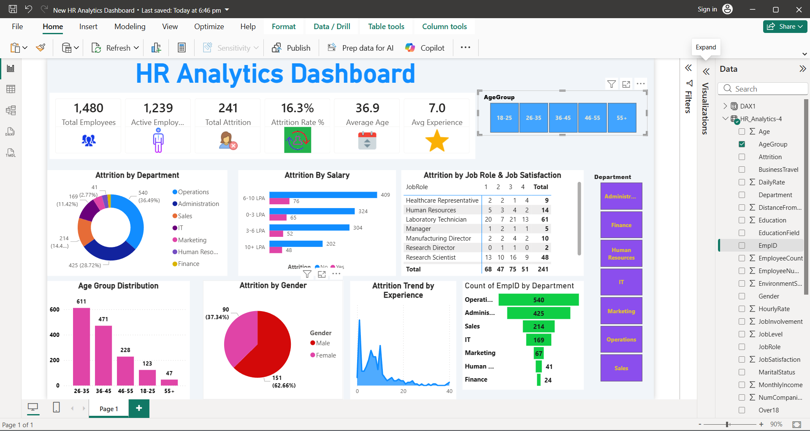

# 👥 HR Analytics Workforce & Attrition Dashboard (Power BI)

An enterprise HR analytics framework deployed to audit workforce headcount stability, attrition distributions, and job satisfaction levels.

## 🚀 Key Performance Indicators (KPIs)
* **Total Employees:** 1,480
* **Active Workforce:** 1,239
* **Total Attrition Volume:** 241
* **Overall Attrition Rate:** 16.3%
* **Average Employee Age:** 36.9 Years

## 🔍 Core Visual Insights
* **Department Constraints:** Sectioned attrition counts across Operations, Sales, IT, and Finance.
* **Satisfaction Matrices:** Formatted text tables intersecting job roles against direct job satisfaction metrics.
* **Demographics & Compensation:** Evaluated attrition trendlines against salary structures and experience bands.

## 🛠️ Tech Stack & Methodology
* **BI Tool:** Power BI Desktop
* **Data Modeling:** Star Schema architecture linking employee demographics.
* **Features:** Cross-filtering, custom card designs, and attrition metrics.

---

## 📷 Dashboard Screenshot

## 🎥 Interactive Workflow (Silent Walkthrough)

